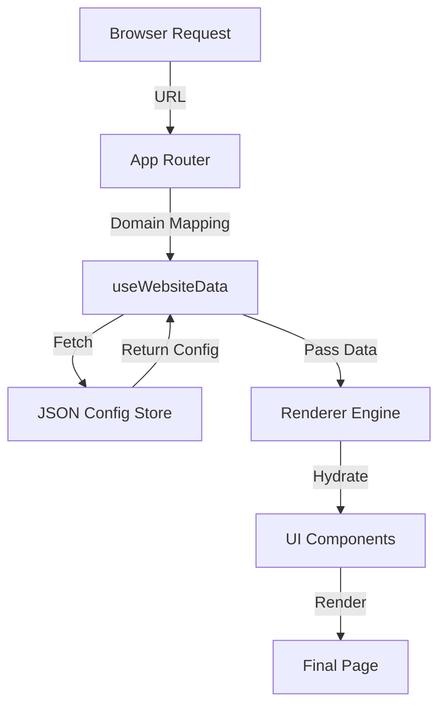

# System Architecture: The "Headless" Engine

## 1. Executive Summary
This document outlines the architectural decisions behind the Enterprise Multi-Tenant Platform. Unlike traditional monolithic CMS solutions (WordPress, Drupal) or simple static site generators, this platform utilizes a **JSON-Driven Headless Architecture**. This approach decouples the *Content* (Data) from the *Presentation* (React/UI), enabling ease of scale typically found in enterprise-grade systems at companies like Uber or Netflix.

## 2. Core Design Principles (`Big Tech` Standards)

### A. Separation of Concerns (SoC)
*   **Data Layer**: Strictly typed JSON files in `src/@local-db/`. This is the "Database".
*   **Presentation Layer**: Reusable, stateless React components (HOCs) in `src/views/`.
*   **Logic Layer**: Custom hooks (`useWebsiteData`) that bridge Data and UI.

**Why this matters**: You can redesign the entire *UI* (e.g., switch from Tailwind to Material UI) without touching a single line of *Content*. Conversely, you can rewrite all *Content* without risking *UI* bugs.

### B. The "Renderer" Pattern
Instead of hardcoding pages (`About.tsx`, `Contact.tsx`), we use a central `Renderer.tsx` engine.
*   **Input**: A JSON object `{ type: "Hero", data: { ... } }`.
*   **Process**: The Renderer looks up the mapping `Hero -> <HeroBanner />`.
*   **Output**: The correct React component with data injected.

**MNC Benefit**: This allows us to "remote control" the detailed composition of a page via configuration, paving the way for backend-driven UI (Server-Driven UI), a standard pattern in super-apps (Airbnb, Grab).

## 3. Tech Stack & Decisions
*   **React 18**: For concurrent rendering and component ecosystem.
*   **TypeScript**: non-negotiable for enterprise maintenance. strict typing prevents "undefined is not a function" errors in production.
*   **Vite**: For next-gen build speeds (HMR).
*   **Tailwind CSS**: Utility-first styling for rapid, consistent design tokens.

## 4. Multi-Tenancy Architecture
The system identifies the "Tenant" (Client Site) via the `window.location.hostname`.
1.  **Request**: User visits `gayatrilodge.com`.
2.  **Resolution**: `useWebsiteData` maps `gayatrilodge.com` -> `gayatrilodge.json`.
3.  **Hydration**: The app hydrates *only* with that JSON data.
4.  **Result**: The user sees a fully branded site for Gayatri Lodge, unaware that `ForeGrow Solutions` exists in the same bundle.

## 5. System Diagram

